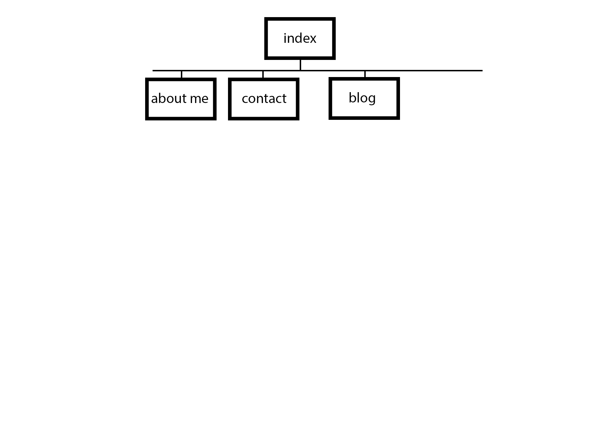

* What are the 6 Phases of Web Design?
  1. Information Gathering - This is the phase where you do research on what your site should do,  the purpose. You also should ask the client questions about what they need the website to do.
  2. Planning - this is where the sitemapping, wireframing, etc comes in. You layout what needs to be done, how it's going to work on the website, how many clicks deep things are going to be placed.
  3. Design - norm
  4. Development
  5. Testing and Delivery
  6. Maintenance
* What is your site's primary goal or purpose? What kind of content will your site feature?
  * The
* What is your target audience's interests and how do you see your site addressing them?
  *
* What is the primary "action" the user should take when coming to your site? Do you want them to search for information, contact you, or see your portfolio? It's ok to have several actions at once, or different actions for different kinds of visitors.
  * First and foremost, it should be aesthetically pleasing to all - sleek and not too clunky. I think that I'd want the portfolio to be one of the first things, so that prospective employees.
* What are the main things someone should know about design and user experience?
* What is user experience design and why is it valuable?
* Which parts of the challenge did you find tedious?
  * Most of it. Honestly, I've been a UI designer for years. I haven't done the more basica stuff like site mapping in a while, so I guess it's good to flex those muscles.
