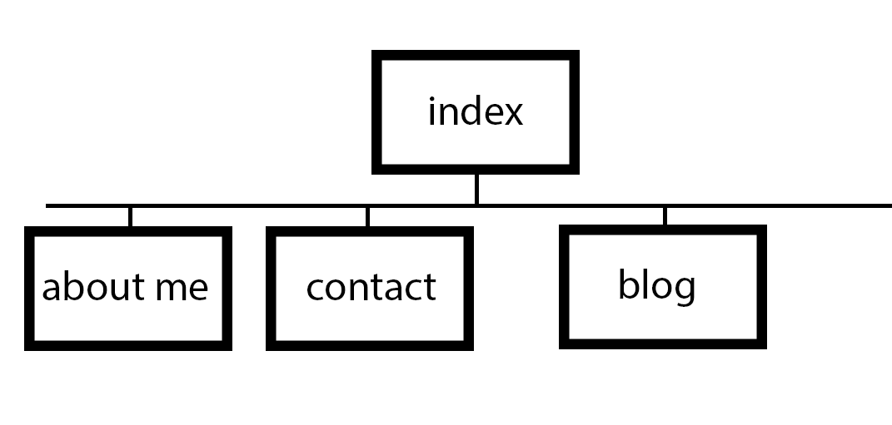

* What are the 6 Phases of Web Design?
  1. Information Gathering - This is the phase where you do research on what your site should do,  the purpose. You also should ask the client questions about what they need the website to do.Then you, your team, and your client set goals for the website- what it needs to achieve functionally. If your designer is involved the looks will be discussed too, hopefully, so you can coordinate. You also talk about who is going to be your users/customers, how to optimize their experience. Then you may also talk about what is needed on the website, figuring out what the user/customer is looking for. This might involve consulting the legal department for pertinent phrasing wrt to projects. If this is necessary, do it sooner rather than later because they are slow.
  2. Planning - this is where the sitemapping, wireframing, etc comes in. You layout what needs to be done, how it's going to work on the website, how many clicks deep things are going to be placed. Most importantly in the planning, keep a balance between good user design and pleasing user design.
  3. Design - this depends on your position, some larger places have designers, but mostly you work with them to combine style/design with the function that you as a dev can provide. You and the designer should discuss how the site is going to look. They might provide you with prototypes or even wire frames to explain how the website should look.
  4. Development - This is where you actually build the thing. You or the designer create the CSS framework plug in all the HTML documents, forms, and shopping carts needed. If you are not designing, the designer will keep you in the loop for comments. This site will also be up to date with current web standards.
  5. Testing and Delivery - this is when you send out your fledgling site to the testers who will run every user case scenario through it that you can ever imagine. They validate the code, they check SEO text, they inspect elements, the ensure that you have a test case for if someone doesn't enter a valid email.
  6. Maintenance - This is the end goal. You will be updating any new legal information, code compatibility, or pages. The site is live and works. Maintenance mode is less stressful unless something goes wrong. Regardless, it's also good to do regular site backups and code or plugin updates as well.
* What is your site's primary goal or purpose? What kind of content will your site feature?
  * The site I'm planning will primarily be a design portfolio, with a resume and contact information. I will also likely add more information as my portfolio and designs grow.
* What is your target audience's interests and how do you see your site addressing them?
  * My target audiences is future employers, coworkers and friends. My goal to address them is to make a stylish, simple, elegant and functional site. My future employers/coworkers are to be impressed, my friends to think it's cool [and if they have money, commission me :)]
* What is the primary "action" the user should take when coming to your site? Do you want them to search for information, contact you, or see your portfolio? It's ok to have several actions at once, or different actions for different kinds of visitors.
  * First and foremost, it should be aesthetically pleasing to all - sleek and not too clunky. It also needs to have good, simple flow and be comprehensible. I think that I'd want the portfolio to be one of the first things, so that prospective employers would know right away where to go to see my designs. I'd also make resume up there, as well a s contact info. Basically, go to website, see awesome portfoilio and resume, see contact info, contact for job.
* What are the main things someone should know about design and user experience?
  * Design isn't always about making things look pretty. Work for a large enough company and they'll have someone to do that. Design is about balance. Form and function need to be in harmony. Provide enough information about the function to give the best foundation for the form of the designer. User Experience is a vital part of creating that balance. Think of who will use this and why. It's critical to creating/designing.
* What is user experience design and why is it valuable?
  * User experience design is designing something with your user/target audience/customer foremost in mind. It's looking at the website, and seeing how many clicks before they turn away and getting to less than that. It's basically figuring out how to make your website work best for the largest section of your target audience. This is vital because if your target audience is conservatives, putting rainbow flags and MORE GOVERNMENT 4EVR and TAKE ALL MY GUNS all over the site is really going to take a hunk out of your user base. Knowing what the user wants, in terms of experience, knowledge, and usability is extremely important to the usefullness and viability of a website.
* Which parts of the challenge did you find tedious?
  * Most of it. Honestly, I've been a UI designer for years. I haven't done the more basic stuff like site mapping in a while, so I guess it's good to flex those muscles. Plus, I always like to learn more and newer things.