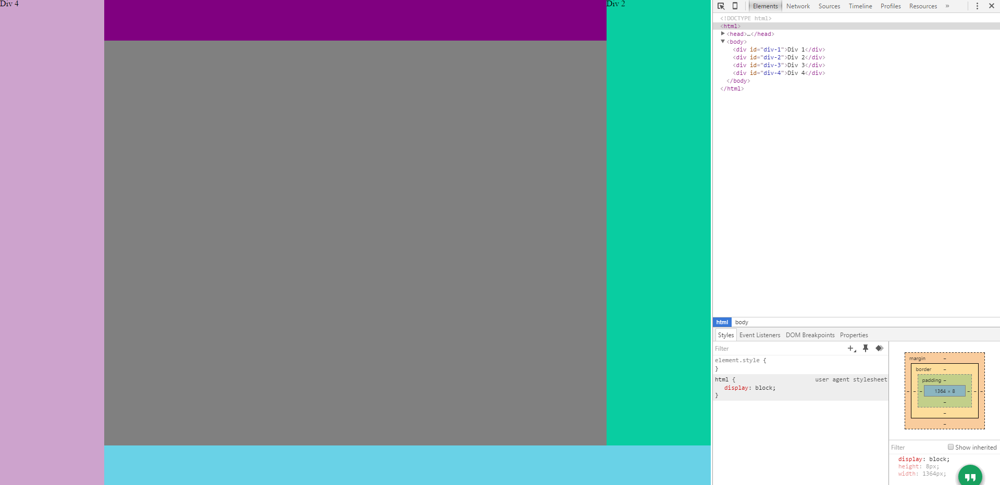

1. How can you use Chrome's DevTools inspector to help you format or position elements?
  * It highlights the element you're on, so it helps you know what piece you are manipulating. It's also good for auto filling many of the elements that you are using. All of this makes it clear what to do and where you are doing it.
2. How can you resize elements on the DOM using CSS?
  * Using margin/padding,and the positioning will let you resize elements.
3. What are the differences between absolute, fixed, static, and relative positioning? Which did you find easiest to use? Which was most difficult?
  * Absolute secures it regardless of anything. fixed secures it in one spot relative to the other elements, static means it will move around depending on other elements but not resize, relative means it's size and location are entirely relative to other elements. Absolute nad fixed are the easiest because they'll always generally be in the same place at all times. I don't think I have relative down at all.
4. What are the differences between margin, border, and padding?
  * border is a visible outline, margin is inside, padding is it's relative distance from other objects.
5. What was your impression of this challenge overall? (love, hate, and why?)
  * I found it kinda fun, because it's just getting you used to manipulating items. It also started getting my on memorizing these things, which I don't quite have done. I hope that I've explained things well. It doesn't always come out of my brain the same way it goes in. I have to rearrange things into my verbal designs. Sorry.

